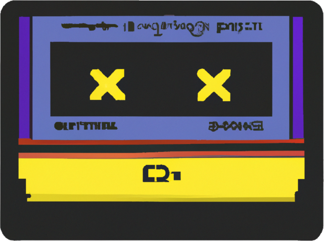

    

 

# RetroMan
This project is still under contruction, any help is appreciated, see below.

RetroMan is a ROMs manager project that helps you to manage your roms library and sync it with your devices.
This super hero software aims to be the only solution when comes to manage your roms.

**Note:** the main branch is actually a develop branch as the software is still unmatured enough to be called even a beta.

## Planned features
- Multi device support: aims to support all the devices on the market, either they are devices or softwares like Miyoo devices, Anbernic Devices, RetroDECK, Batocera, RetroPie (custom device managements as yml templates with their own rules)
- Scraping support
- RetroAchievements support
- Decide which ROMs you want to syncronize on which device with various protocols (local copy, s/ftp, smb)
- Saves backup
- It knows which system are supported or available on the device (supported = surely working, available = emulator is available but may not be really playable)
- Duplicates management
- CLI support
- Rom renaming system
- Saves sync between devices if supported, or enforced
- ARCADE romsets support
- Collection support (move collections in and over)
- Format conversions (chd for example)
- m3u generation
- folder as a file support
- cloud storage support
- webserver
- Plugin system
- ROMtation

And more!
Check the planned features under the [enhancements label](https://github.com/RetroMan-project/core/issues?q=is%3Aissue+is%3Aopen+label%3Aenhancement) in our issues page.

## ROMtation:
Hey, you mentioned ROMtation as a feature, what is it?
It's ROM rortation system: when you got a limited memory on your device the ROMtation can be enabled, if enabled it removes the oldest/unused ROMs to make space to the new ones.

## How it will work?
In your main library you can choose which ROMs to sync in which devices, each device template can tell you if that system is supported or available in the selected device (supported = playable, available = avaliable but maybe not fully playable).
When the device is connected it start to sync the ROMs and their scraped metadata and backup the saves/states.
It will scan for the device searching which ROMs are not present in your library and it asks to be imported.
On your Library will show the ROMs scraped metadata, images, boxarts, videos, RetroAchievement data and such.

### From template to actual device
Mainly the software should match the template in `template/template-id.yaml` with the device data in `devices/frienly-name/friendly-name.yml`.
The template is instructing the software how to behave regarding a specific device type, the device folder contain the actual device info.
Let's say that I got two Miyoo Minis, then I will have a single template file but in the devices folder I will have `devices/My Miyoo Mini 1/My Miyoo Mini 1.yml` and `devices/My Miyoo Mini 2/My Miyoo Mini 2.yml` that are pointing to the same template under `templates/miyoominiv3-onion.yml`

### Library template/device
Similar to above but that's the main Library where all the ROMs are synced from (and in some cases to), usually an user got a main library + devices but it's done in this way because it's forseen to implement the multi library support.

### Library and devices folder Structure
Inside every device or library folder there are system subfolders with the gamelist.xml file, for example under `devices/My Miyoo Mini` I got `megadrive/gamelist.xml` and `mastersystem/gamelist.xml`, these gamelists are identical to the EmulationStation ones.
In the Library we got the same files but there is more data to each rom such as on which devices is synced and when it was the last sync.
Then we got the media folder under Library folder for the scraped data, in the screenscraper format.